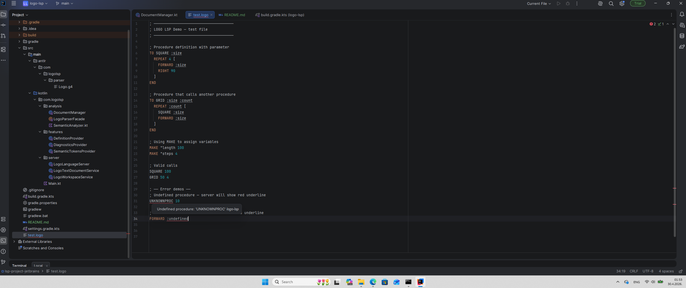

# LOGO LSP Server

A Language Server Protocol implementation for the LOGO programming language, written in Kotlin.

LOGO is an educational programming language known for turtle graphics. This server brings modern IDE features to any LSP-compatible editor.

## Features

- **Syntax Highlighting** — keywords (`TO`, `END`, `REPEAT`...), procedure names, variables (`:size`), and numbers are all colored distinctly
- **Go-to-Declaration** — Ctrl+Click on any procedure or variable reference jumps to its definition
- **Diagnostics** — undefined procedures and variables are underlined in red in real time, with a descriptive error message
- **Hover Documentation** — hovering over any built-in command shows its usage and description; hovering over a user-defined procedure shows where it is declared

## Demo



*Syntax highlighting, real-time diagnostics and hover — all working through LSP.*

## Requirements

- JDK 17 or higher
- An LSP-compatible editor — tested with [LSP4IJ](https://plugins.jetbrains.com/plugin/23257-lsp4ij) in IntelliJ IDEA

## Building

```bash
./gradlew shadowJar
```

The output is a self-contained JAR file at:
build/libs/logo-lsp.jar

## Connecting to LSP4IJ (IntelliJ IDEA)

1. Install the **LSP4IJ** plugin by Red Hat from the JetBrains Marketplace
2. Restart IntelliJ IDEA
3. Go to **File → Settings → Languages & Frameworks → Language Servers**
4. Click **+** and configure the server:
    - **Name:** `Logo LSP`
    - **Command:** `java -jar /absolute/path/to/build/libs/logo-lsp.jar`
5. Open the **Mappings** tab and add file name pattern: `*.logo`
6. Click **OK** — open any `.logo` file and the server starts automatically

## Project Layout
src/main/
├── antlr/com/logolsp/parser/
│   └── Logo.g4                        # ANTLR4 grammar — formal definition of LOGO syntax
└── kotlin/com.logolsp/
├── Main.kt                        # Entry point — starts the LSP server over stdio
├── analysis/
│   ├── DocumentManager.kt         # In-memory store mapping document URI to its text
│   ├── LogoParserFacade.kt        # Facade over the ANTLR lexer and parser pipeline
│   └── SemanticAnalyzer.kt        # Two-pass analysis: builds symbol table, emits diagnostics
├── features/
│   ├── SemanticTokensProvider.kt  # Produces semantic token data for syntax highlighting
│   ├── DefinitionProvider.kt      # Resolves go-to-declaration for procedures and variables
│   └── DiagnosticsProvider.kt    # Converts internal diagnostics to LSP diagnostic objects
└── server/
├── LogoLanguageServer.kt      # Declares server capabilities on initialize handshake
├── LogoTextDocumentService.kt # Handles document events and all incoming LSP requests
└── LogoWorkspaceService.kt   # Workspace-level events (no-op, required by the protocol)

## How It Works

Every time a document is opened or changed, the server runs this pipeline:

Document text
│
▼
ANTLR4 Lexer → Token Stream
│
▼
ANTLR4 Parser → AST
│
▼
SemanticAnalyzer
├── Pass 1: collect all definitions → Symbol Table
└── Pass 2: validate all references → Diagnostics
│
┌──────────────────┼────────────┐
▼                  ▼            ▼
Highlighting   Definition    Hover

The analysis result is cached per document URI. Hover and go-to-declaration
requests reuse this cached result instead of re-parsing on every call.

## Key Design Decisions

**ANTLR4 for parsing** — the grammar file `Logo.g4` is the formal, readable
specification of the LOGO language. ANTLR generates the lexer and parser
automatically, which is more reliable and maintainable than a hand-written parser.

**Two-pass semantic analysis** — LOGO allows forward references: a procedure
can be called before it is defined. A single-pass analyzer would incorrectly
flag these calls as errors. The first pass collects all definitions, the second
validates all references against them.

**Analysis cache** — `LogoTextDocumentService` caches the last `AnalysisResult`
per document. LSP clients send many requests per second (hover fires on every
mouse move). Caching ensures the ANTLR pipeline runs only when content changes.

**Facade pattern** — `LogoParserFacade` is the single point of contact with
ANTLR. All other classes are decoupled from ANTLR internals entirely.

**Case-insensitive lexer** — LOGO treats `FORWARD` and `forward` identically.
This is handled per-character in the lexer rules:
`[Ff][Oo][Rr][Ww][Aa][Rr][Dd]`.

**Full document sync** — the server requests the full document text on every
change. Appropriate for LOGO files which are small, and avoids the added
complexity of incremental sync.

## Example

```logo
; Define a procedure
TO SQUARE :size
  REPEAT 4 [
    FORWARD :size
    RIGHT 90
  ]
END

; Ctrl+Click on SQUARE → jumps to line 2
SQUARE 100

; Red underline — undefined procedure
UNKNOWNPROC 10

; Red underline — undefined variable
FORWARD :undefined
```

## Built With

- [Kotlin](https://kotlinlang.org/)
- [ANTLR4](https://www.antlr.org/) — parser generator
- [LSP4J](https://github.com/eclipse-lsp4j/lsp4j) — LSP implementation for the JVM
- [Gradle](https://gradle.org/) with Shadow plugin for fat JAR packaging